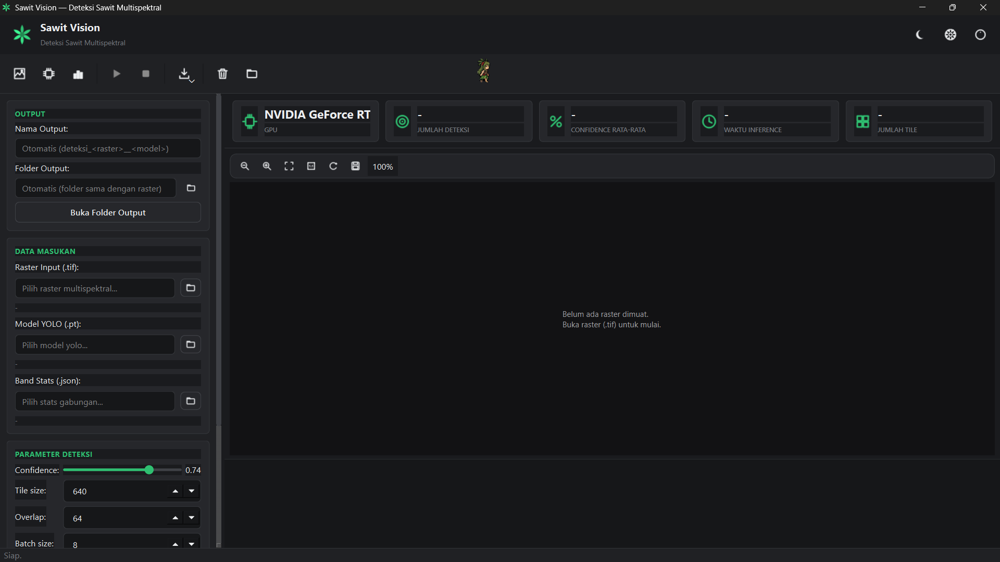

# 🌴 Sawit Vision

Desktop application for **Oil Palm Tree Detection** using a **YOLO-based multispectral object detection model**. Sawit Vision provides an intuitive graphical interface for performing inference on raw multispectral drone imagery, exporting detection results into GIS-compatible formats, and evaluating model accuracy against manual ground-truth centroids.


---

# 📌 Features

- 🌴 Oil palm tree detection using a trained YOLO model.
- 🛰️ Supports **7-channel multispectral imagery**.
- 🖥️ Modern desktop interface built with **PyQt6** (dark & light theme).
- 📍 Automatic export of detection results to **Shapefile (.shp)** and **GeoJSON**.
- 🏷️ **Multi-class support** — works seamlessly with models that detect more than one class (e.g. "Sehat" + "Sakit"); class names are resolved dynamically from the model, no manual configuration needed.
- 🖼️ Bounding box visualization after inference.
- 📊 Confidence score for each detected object.
- ⚡ GPU acceleration with CUDA (optional).
- 📜 Real-time inference log.
- 🔍 Zoomable image viewer.
- 📊 **Dashboard Cards** — click any card (GPU, Jumlah Deteksi, Confidence, Waktu, Tile) to open a themed detail panel showing a full breakdown per class.
- 🐾 **Sawit-Chan mascot** — draggable animated pixel-art character in the toolbar; click to get a reaction, drag to reposition anywhere in the window.
- 📐 **Model Comparison tool** — evaluate one or more inference results (Shapefile / GeoPackage / GeoJSON) against manual ground-truth centroids, with Precision / Recall / F1 / distance-error metrics exported to Excel.

---

# 📷 Application Screenshot

<p align="center">

</p>

---

# 📂 Project Structure

```
Sawit-Vision
│
├── app.py
├── inference_core.py
├── inference_multispectral_v2.py
├── main_window.py
├── comparison_widget.py
├── model_comparison.py
├── build.spec
├── requirements.txt
├── README.md
├── sawit-chan.png
│
├── docs/
│   └── gui_screenshot.png
│
└── dist/
```

---

# 🚀 Installation

## Option 1 — Installer (Recommended)

Download the latest installer from the **Releases** section.

```
SawitVisionSetup.exe
```

Run the installer and follow the installation wizard.

---

## Option 2 — Run from Source

Clone this repository

```bash
git clone https://github.com/zhura24/Sawit-Vision.git
cd Sawit-Vision
```

Install dependencies

```bash
pip install -r requirements.txt
pip install torch torchvision --index-url https://download.pytorch.org/whl/cu124
```

Run the application

```bash
python app.py
```

---

# 🛠️ How to Use — Deteksi Sawit

1. Launch **Sawit Vision**.
2. Select the trained YOLO model (`.pt`) — supports single-class and multi-class models automatically.
3. Select `band_stats_combined.json`.
4. Select the multispectral raster (`.tif`).
5. Click **Jalankan Deteksi**.
6. Wait until inference is completed.

The application will automatically generate:

- Detection preview
- Bounding boxes (per class, color-coded)
- Confidence scores
- JPG visualization
- Shapefile (.shp) with class attribute

---

# 📐 How to Use — Pembanding Model (Model Comparison)

Use this tool to score how well an inference result matches manually digitized ground-truth centroids — useful for comparing multiple models/configurations objectively.

1. Click the **Pembanding Model** button on the toolbar.
2. Select the **manual centroid** file (ground truth) — accepts `.shp`, `.gpkg`, or `.geojson`.
3. Click **+ Tambah Model** to add one or more inference result files, giving each a label (e.g. "Combined Model", "RGB Model").
4. Set the **distance threshold** (in meters) — a detection is counted as correct (TP) if it lies within this distance of the nearest ground-truth point. A sensible starting point is roughly half the canopy radius (~1–1.5 m).
5. Click **Jalankan Perbandingan**.
6. Review the Precision / Recall / F1 / mean & RMSE distance-error table for each model.
7. Click **Export Hasil...** to save a full report (summary Excel + per-model TP/FP/FN shapefiles, organized per-model subfolder).

---

# 📁 Output Example

After inference, the application produces:

```
Output Folder
│
├── detection_result.jpg
├── detection_result.shp
├── detection_result.dbf
├── detection_result.shx
└── detection_result.prj
```

After a model comparison export:

```
Perbandingan_Model_<timestamp>/
│
├── perbandingan_model.xlsx
│   ├── Ringkasan        (summary table across all models)
│   ├── Info             (threshold used, number of models)
│   └── Detail_<Model>   (one sheet per model: TP/FP/FN + coordinates)
│
├── NamaModel_A/
│   ├── TP/
│   ├── FP/
│   ├── FN/
│   └── Gabungan/
│
└── NamaModel_B/
    ├── TP/
    ├── FP/
    ├── FN/
    └── Gabungan/
```

---

# 🏗️ Build Executable

Build using PyInstaller

```bash
pyinstaller build.spec
```

The executable will be generated inside:

```
dist/SawitVision/
```

For distribution, it is recommended to use the installer generated with **Inno Setup**.

---

# 💻 Technology Stack

- Python 3.12
- PyQt6
- Ultralytics YOLO
- PyTorch
- Rasterio
- NumPy
- OpenCV
- SciPy (nearest-neighbor matching for model comparison)
- OpenPyXL (Excel report export)
- PyShp / PyProj (CRS-aware GeoJSON export)

---

# 📋 Changelog

## v1.3.0
- ✅ **Multi-class inference support** — model dengan 2 kelas atau lebih langsung bekerja tanpa konfigurasi tambahan; NMS kini bekerja per-kelas sehingga objek dari kelas berbeda tidak saling menghapus.
- ✅ **Dashboard Card detail dialog** — klik kartu (GPU, Jumlah Deteksi, dll.) untuk membuka panel rincian yang menyesuaikan tema terang/gelap secara otomatis.
- ✅ **Sawit-Chan bisa di-drag** — klik dan seret maskot Sawit-Chan ke posisi mana pun di dalam jendela aplikasi; setelah dilepas, maskot akan kembali berjalan otomatis dari posisi baru.
- ✅ **Perbaikan panah SpinBox** — tombol naik/turun pada input angka (Tile size, Overlap, Batch size) kini menampilkan panah bawaan sistem operasi secara konsisten.
- ✅ **Sidebar Pembanding Model bisa di-scroll** — teks informasi threshold tidak lagi terpotong pada layar kecil.
- ✅ **Nama kelas dinamis pada ekspor** — GeoJSON dan CSV hasil ekspor sekarang mencatat nama kelas asli dari model (tidak lagi hardcode "sawit").

## v1.2.2
- ✅ Output export Pembanding Model sekarang otomatis dikelompokkan ke dalam sub-folder per model (TP, FP, FN, Gabungan).
- ✅ Perbaikan bug CRS pada export GeoJSON: file ground truth dengan CRS UTM eksplisit kini diresolve lewat pyproj, mendukung EPSG apapun secara otomatis.

---

# ⚠️ Notes

- The application installer may exceed **1 GB** because PyTorch and CUDA libraries are included.
- The trained model (`.pt`) is **not embedded** inside the application and should be selected through the GUI.
- CUDA is optional but recommended for faster inference.
- The Model Comparison tool reads point geometries only (`.shp`, `.gpkg`, `.geojson`); for polygon inputs (Sawit Vision output), containment-based matching is used automatically.

---

# 👨‍💻 Authors

Developed by:

**zhura24**

Computer Engineering
Universitas Diponegoro

---

# 📄 License

This project is intended for academic and research purposes.


